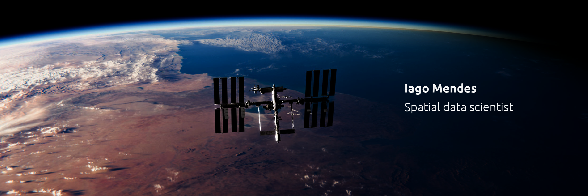

  

# Iago Mendes
*Forest Engineer, Spatial Data Scientist, M.Sc. Student in Forest Management*

**Background in:** Remote Sensing, GIS, Machine Learning, Forestry, Forest Management, Python, R and JavaScript.

## Links
*   [LinkedIn](https://www.linkedin.com/in/iago-mendes/)
*   [Medium](https://medium.com/@oiagomendes)
*   [ResearchGate](https://www.researchgate.net/profile/Iago-Mendes-De-Oliveira)
*   [Instagram](https://www.instagram.com/oiagomendes/)

## Projects
*   [Exploratory Data Analysis on Airbnb Seattle Data](notebooks/PRJT1_Analisando_os_Dados_do_Airbnb_.ipynb) 🇧🇷 | 🇺🇸 (coming soon)
